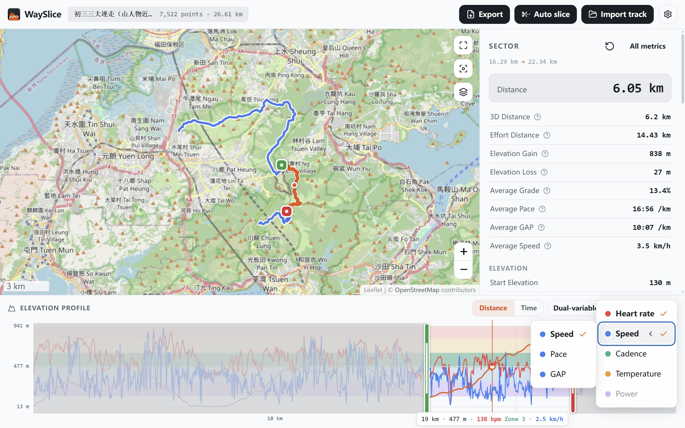

> The README is machine-generated, if you find issues please submit a PR.
>
> この README は機械によって生成されています。問題を見つけたらプルリクエストを送ってください。

<p align="center">
  
</p>

<h1 align="center">WaySlice</h1>

<p align="center">
  <strong>Telemetry for every way. Sliced.</strong><br><strong>歩んだ道は、みなテレメトリーに。切り出して、分析する。</strong>
</p>

<p align="center">
  <a href="README.md">English</a> | 日本語 | <a href="README.ko.md">한국어</a><br><a href="README.fr.md">Français</a> | <a href="README.de.md">Deutsch</a> | <a href="README.es.md">Español</a> | <a href="README.it.md">Italiano</a>
</p>

WaySlice はオープンソースの純フロントエンド GPX/FIT/TCX/KML/KMZ トラックアナライザーです。トラック全体の統計ではわかりません。知りたいのは、あの長い登りはどれだけかかったか、テクニカルな下りでどれだけ攻められたか、レース最後の 5 km で失速していないか。WaySlice があれば、任意のセクターを切り出して、モータースポーツのテレメトリーや航空機の QAR（クイックアクセスレコーダー）データのように単独で分析できます:

```text
トラック → セクター選択 → セクター分析
```

<p align="center"></p>

<p align="center"><a href="./screenshots/README.ja.md">スクリーンショットをもっと見る</a></p>

用語に不慣れな場合は、まず[用語集](#用語集)へ。本文中の用語はすべて、そこで定義した意味で使います。

## 目次

- [用語集](#用語集)
- [機能](#機能)
- [対応フォーマット](#対応フォーマット)
- [はじめに](#はじめに)
  - [セクターの分析方法](#セクターの分析方法)
- [プライバシー](#プライバシー)
- [単位系](#単位系)
- [設計ノート](#設計ノート)
- [テスト](#テスト)
- [コントリビューション](#コントリビューション)
  - [プロジェクト構成](#プロジェクト構成)
  - [UI 言語を追加する](#ui-言語を追加する)
  - [地図ソースを追加・編集する](#地図ソースを追加編集する)
  - [サイトアイコンの差し替え](#サイトアイコンの差し替え)
  - [翻訳版 README を追加する](#翻訳版-readme-を追加する)
- [ロードマップ](#ロードマップ)
- [ライセンス](#ライセンス)
- [謝辞](#謝辞)
- [支援者](#支援者)

## 用語集

この README とアプリ UI では、以下の用語を固定された意味で使います。本文でこれらの語が出てきたら、必ずこの定義のとおりに読んでください:

| 用語 | 意味 |
|------|---------|
| トラック（Track） | 1 つのファイルから読み込んだ、1 本の記録ルート: 順序付けられたトラックポイントの列。 |
| トラックポイント（Track point） | トラック上の 1 つの測定点: 位置に加え、ファイルが持っていれば標高・タイムスタンプ・心拍・ケイデンス・パワー・温度。 |
| **セクター（Sector）** | WaySlice の中核概念。トラックのうち、あなたが選んだ始点と終点の間の部分。境界は 2 つのトラックポイントの間のどの場所でも取れます（補間）。トラック全体も既定のセクター「全区間」です。すべての指標は現在のセクターに対して計算されます。 |
| セクターハンドル（Sector handle） | セクターの境界を決める、ドラッグできる丸い点。緑 = 始点、赤 = 終点。地図と標高プロファイルの両面に表示され、リアルタイムで同期します。 |
| 獲得 / 下降標高（Elevation gain / loss） | セクター内の上り / 下りの合計。3 m のノイズフィルターを通した値です（[設計ノート](#設計ノート)参照）。 |
| VAM / VDM | 1 時間あたりの垂直上昇 / 下降メートル数（Vertical Ascent / Descent Meters per hour）。実際に上昇 / 下降していた時間だけを分母にします。 |
| 移動時間（Moving time） | 経過時間から停止を引いたもの。停止は速度 0.5 km/h 未満が 10 秒以上続いた状態です。 |
| GAP（等価ペース） | 実測ペースを Minetti（2002）の坂道補正係数で割った、同等の努力に相当する平地ペース。 |
| 等価距離（Effort distance） | 水平距離 + 獲得標高 ÷ 100: 標高 100 m の登りを 1 km として換算します。 |
| 3D 距離（3D distance） | 地形に沿った距離: セグメントごとに `√(水平² + 垂直²)` を累積した値で、水平距離とは別に報告されます。 |
| 勾配（Grade） | ある地点または区間の傾斜: 垂直変化 ÷ 水平距離。パーセント表示（正 = 上り、負 = 下り）。 |
| ペース（Pace） | 距離 1 単位にかかる時間: min/km または min/mi。 |
| ウェイポイント（Waypoint） | トラックファイル自体に保存された、名前付きの場所（GPX `<wpt>`、KML `<Point>`）。 |
| ベースマップ（Basemap） | トラックの下に描画される地図タイルのソース。既定は OpenStreetMap。 |

## 機能

- **地図 + 標高プロファイル。** どちらの面でもセクターハンドルをドラッグして選択。両者はリアルタイムで同期し、境界は 2 つのトラックポイントの間への補間位置まで正確に指定できます。
- **地図とプロファイル上のウェイポイント。** GPX（`<wpt>`）と KML（`<Point>`）のウェイポイントを地図と標高プロファイルにピンで表示し、ホバーで名前を表示。「トラックに合わせる」の下のピンボタンで表示/非表示を切り替えられます。地図のピンにホバーすると、プロファイルの対応位置に印が付きます。ピンをクリックすると、縮尺を変えずにその地点が地図の中央に来ます。
- **プロファイルのホイールズーム（デスクトップ）/ ピンチズーム（タッチ）。** 標高プロファイルにカーソルを重ねてホイールを回すと、カーソルを中心に距離/時間軸をズームします。Shift を押しながらドラッグでパン。タッチ端末は 1 本の指でパン、2 本の指のピンチでズームします。プロファイルのどこでもダブルクリック（タッチではダブルタップ）すれば全区間に戻ります。
- **自動分割。** ヘッダーのハサミボタンでトラック全体の区間リストを生成：ウェイポイント間（CP ごと）、固定距離（1 km / 5 km / カスタム、ヤード・ポンド法ではマイル）、勾配（登り/下り区間）で切れます。各行は区間番号・距離範囲・タイプカプセル（起伏から上り・下り・平坦・混合を判定）・時間・ペース・心拍の順で表示され、狭い画面では2行に分かれてカプセルに文字が入り、データ行は距離の起点に左揃えになり、行を展開すると 3D 距離、等価距離、獲得/損失標高、GAP、VAM/VDM の区間詳細が現れ、メインのセクターもその区間へ移動します。
- **セクター指標。** 水平距離、3D 距離、等価距離、獲得/損失標高、勾配、経過時間/移動時間、ペース、速度、GAP、そしてファイルにあれば心拍数・ケイデンス・パワー・温度。欠落データは 0 ではなく*データなし*と表示されます。
- **2変数分析。** プロファイル操作列の散点アイコンで、2次元密度ヒートマップを開けます。心拍数、速度、ペース、GAP、ケイデンス、パワー、温度、勾配、標高から有効な組み合わせを選択できます。分析範囲は現在選択中のセクターに従い、各物理量の値は指標パネルと同じ機構から取ります: 心拍数・ケイデンス・パワーはパネルと同じく一時停止中の読み取りを除去して 5 点平滑をかけ、温度はそのまま（一時停止中も含む）、勾配はパネルの 50 m 勾配ウィンドウ、速度族はパネルの「最高速度」のセクター系列です。セルにカーソルを合わせると、その X・Y・相対密度を読み取れます。テーマ・単位・言語はその場で切り替わり、専用のチャートモジュールにより 10 万点規模のトラックも軽快に動作します。タッチでは 2 本の指でピンチとパン、1 本の指はデータの読み取り、ダブルタップで全範囲に戻ります。
- **エクスポート。** 現在のセクターをダウンロード: 指標は csv・txt・md で、トラックポイントは GPX ファイルで出力されます。クリック時点の言語と単位系に従います。
- **メートル法 / ヤード・ポンド法。** 表示単位を即座に切り替え。既定はメートル法で、設定はローカルに保存されます。
- **多言語対応。** English、Français、日本語、韓国語、Deutsch、Español、Italianoを内蔵。新しい言語はデータファイル 1 つで追加できます（[コントリビューション](#コントリビューション)を参照）。
- **アーキテクチャによるプライバシー保護。** アップロード用コードは存在しません。ファイルは File API で読み込まれ、解析・描画はすべてブラウザー内で完結します。
- **ビルド不要。** 純粋な ES モジュール。そのまま読めて、実行でき、コントリビュートできます。

## 対応フォーマット

| フォーマット | ジオメトリ | 標高 | タイムスタンプ |
|--------|----------|-----------|------------|
| `.gpx` | `<trk><trkseg><trkpt>`（複数セグメント） | ✅ | ✅ |
| `.fit` | Garmin FIT バイナリのアクティビティファイル | ✅ | ✅ |
| `.tcx` | TrainingCenterDatabase XML | ✅ | ✅ |
| `.kml` | `LineString` + `gx:Track` | ✅（座標から） | ✅（`gx:Track` / `<when>`） |
| `.kmz` | ZIP → KML（ネイティブ `DecompressionStream`、ライブラリー不要） | ✅ | ✅ |

FIT のデコードは、同梱の [fit-parser](https://github.com/jimmykane/fit-parser) ライブラリー（MIT、`vendor/fit-parser/`）が担い、TCX は内蔵の DOM パーサーで直接読みます。GPX の一般的なセンサー拡張は localName で識別され、名前空間プレフィックスは問いません：Garmin TrackPointExtension（心拍/ケイデンス/気温/速度/距離）と 3 種類のパワー表記（裸の `<power>`、`PowerInWatts`、`ns3:Watts`）。すべてのフォーマットは同じトラックポイントモデルに流れ込むため、セクター指標はソース形式に依存しません。

## はじめに

**Try it: https://wayslice.com**

静的ファイルサーバーがあれば動作します。ビルドは一切不要です:

```bash
# Python
python -m http.server 8080

# または Node
npx serve .
```

<http://localhost:8080> を開き、GPX/FIT/TCX/KML/KMZ ファイルをドロップしてください。

> `index.html` を `file://` で直接開いても動作しません。ブラウザーが `file://` URL 上の ES モジュール読み込みをブロックするためです。

### セクターの分析方法

1. トラックをドロップします。既定では全区間が選択されています。
2. **地図または標高プロファイルで緑/赤のセクターハンドルをドラッグ** — トラック/プロファイル上をクリックして最も近い境界を動かしたり、プロファイル上をドラッグして新しい範囲を指定することもできます。タッチ端末では、1本の指でズームしたプロファイルを移動し、ピンチでズームします。範囲の変更はハンドルのドラッグのみです。
3. 変更のたびにセクターが即座に再計算されます: 距離、3D 距離、獲得/下降標高、勾配、ペース/速度、最速/最遅 1 km。
4. キーボード操作: ハンドルにフォーカスして矢印キー（Shift = ×10、Home/End = 端点へジャンプ）。`Esc` でメニューを閉じます。
5. タッチデバイスは協調ジェスチャーです: 1本の指でページをスクロールし、2本の指で地図を動かします（地図上にヒントが表示されます）。
6. できあいの区間が欲しいときは、ヘッダーの「自動分割」ボタン——ウェイポイント・距離・勾配でトラック全体の区間リストを生成します。

## プライバシー

- トラックはブラウザー内でのみ処理されます: 解析 → 分析 → 描画、すべてローカルです。
- ネットワーク要求は選択したベースマップの**地図タイル**のみ。トラックデータが送信されることはなく、アナリティクスもありません。
- テーマ、言語、ベースマップ、単位の設定はデバイス上の `localStorage` にのみ保存されます。

## 単位系

WaySlice は既定で**メートル法**を使用し、**ヤード・ポンド法**にも対応しています。ヘッダー右上の歯車ボタンから「設定」ドロワーを開くと、単位は言語やテーマと隣り合わせです:

| 表示項目 | メートル法 | ヤード・ポンド法 |
|---|---|---|
| 長い距離 | km | mi |
| 短い距離 / 標高 | m | ft |
| 速度 | km/h | mph |
| ペース | min/km | min/mi |
| 勾配 | % | % |

解析と計算は常に SI 単位（メートル、メートル/秒、秒/キロメートル）で行われます。単位の切り替えは既存の計算結果の再フォーマットのみを行い、ファイルの再解析、セクターの再計算、トラックジオメトリの変更は一切行いません。この設定は `wayslice-units` というキーで保存され、再読み込み後も保持されます。言語と単位は互いに独立しており、任意の言語とどちらの単位系も自由に組み合わせられます。

## 設計ノート

- **3D 距離**はセグメントごとに `√(水平² + 垂直²)` で計算され、水平距離とは別に報告されます。
- **等価距離** = 水平距離 + 獲得標高 ÷ 100（標高 100 m の登りを 1 km として換算）。
- **平均勾配**は区間の累積獲得標高を水平距離で割った値であり、各点の勾配の平均ではありません。下りだけの区間には平均できる登りがなく「—」が表示されます。最大/最小勾配は約 50 m の窓で計算され、GPS ノイズによる偽の記録的勾配を防いでいます。
- **獲得/下降標高**は 3 m のヒステリシスフィルターを適用します。標高変化が ±3 m を超えた時点で計上し、3 m 未満のノイズは合計に含まれません。
- **VAM/VDM** の分母は、実際に上昇/下降している時間（フィルター後の標高トレンド方向）であり、セクター全体の時間ではありません。
- **移動時間**は停止（速度 0.5 km/h 未満が 10 秒以上継続）以外のセグメントを計上します。
- **平均速度・平均ペース**は区間ごとの移動速度から計算し、プロファイルと同じ規則で整えます。記録速度がある場合は 5 点スライディングウィンドウでスパイクを近傍に薄めます。記録速度がない場合は 3 標準偏差の規則のみ適用します。**最高速度**はプロファイルの速度曲線と一致します。整えた後のポイント別速度の最大値で、リストとグラフは常に一致します。
- **平均 GAP**は区間ペースを Minetti（2002）の坂道補正係数（勾配は ±45% にクランプ）で割って平均したもの — 同じ努力での平地ペースを表します。プロファイルでは速度/ペース/GAP が 1 つのオーバーレイ枠を共有します。
- **プロファイルの速度曲線クリーニング**：速度の取得元で規則を選びます — 記録速度は各読みをその時の dd/dt とクロスチェックし（50% を超える読みは除去）、5 点スライディングウィンドウで平滑化します（各プロット値は自身と前後 2 点の平均）。計算速度は位置差から求め、3σ 原則で直接整えます（超えた値は近傍補間）。停止中の 0 速もデータであり、ほかと同じくウィンドウ平均に参加します。
- **表示の簡略化**（地図は Douglas–Peucker、プロファイルはピクセル列ごとの最小-最大サンプリング）は元データに決して触れません。指標は常に完全なデータで計算されます。
- **プロファイルズーム**は距離モード最小 1 km、時間モード最小 20 分のウィンドウまで対応。タッチ端末は 2 本の指のピンチでズームします（ホイールは非対応）。
- 大きなトラック（10 万点以上）に対応。ハンドルドラッグ中の境界検索は、前回の一致位置を種にした拡張窓探索を使用します。

## テスト

同じサーバー上で `tests/index.html` を開いてください:

```text
http://localhost:8080/tests/
```

テストスイートは距離計算、点間補間、勾配窓、時間指標、GPX/FIT/TCX/KML/KMZ 解析（破損したファイルやアーカイブ、パワー/センサー拡張を含む）、テーマ設定マトリクス（システム/手動 × OS ライト/ダーク）、言語フォールバックチェーン、そしてメートル法/ヤード・ポンド法の変換（ペースの丸め、VAM、永続化、単位に依存しない勾配を含む)に加えて、セクターのエクスポート(csv/txt/md/gpx の内容とファイル名)も検証します。

## コントリビューション

### プロジェクト構成

```text
index.html              ページシェル + テーマ起動スクリプト（テーマのフラッシュなし）
icons/                  サイトアイコン資産（favicon.svg と各サイズ PNG/ICO、プレビューページ）
site.webmanifest        PWA インストール用メタデータ（名前、テーマ色、アイコン）
css/                    デザイントークン（ライト/ダーク）、ベース、レイアウト、コンポーネント
js/
  parsers/              GPX / FIT / TCX / KML / KMZ → 統一されたトラックポイント配列
  geo/                  ハバーサイン + 3D 距離、補間、簡略化
  metrics/              セクター指標（純関数、独立してテスト可能）
  sector/               セクター選択状態（唯一の情報源）
  map/                  MapLibre ビュー、ベースマップカタログ、セクターハンドル
  charts/               Canvas チャート（標高プロファイル、2変数分析）
  theme/                システム / ライト / ダーク、OS にリアルタイム追従
  language/             言語コア + lang-*.js 言語パック + テンプレート
  units/                メートル法 / ヤード・ポンド法の設定、SI 表示変換、ローカライズ済み単位ラベル
  ui/                   指標パネル、設定ドロワー、自動分割、メニュー、シート、アップロード、アイコン
  core/                 軽量イベントバス + ストア
  utils/                ロケール対応フォーマット（Intl）
tests/                  ブラウザーで実行できるテストスイート（tests/index.html）
vendor/fit-parser/      バンドル済み fit-parser ツールキット（FIT デコード、MIT）+ buffer シム
```

計算ロジックは UI から完全に分離されています。`computeSectorMetrics()` などの関数は DOM にアクセスせず、テストでカバーされています。

### UI 言語を追加する

WaySlice の翻訳システムは意図的に依存関係のない設計です。**1 つの言語 = 1 つのデータファイル**。JavaScript ファイルを編集できれば、誰でもアプリを翻訳できます。

1. [`js/language/lang-template.js`](js/language/lang-template.js) を `lang-xx.js` としてコピーします
   （`xx` は `es`、`pt-BR` などの BCP 47 コード）。
2. 右側の文字列をすべて翻訳します。キーと `{プレースホルダー}` はそのまま維持し、専門用語は統一してください（セクター、3D 距離、獲得/下降標高、勾配、ペース、VAM）。
3. [`js/language/langs.js`](js/language/langs.js) のカタログに 1 件追加します — 言語コード・自国語名・遅延ローダーだけです。言語パックは必要時に読み込まれ、起動時に取得するのは訪問者の言語と英語だけです。
4. アプリを開いて自分の言語に切り替え、コンソールを確認します。WaySlice は英語の正規キーを基準に読み込み済みの言語パックを検証し、欠落/未知のキーについて警告します。
5. プルリクエストを送信してください。

欠落しているキーは自動的に英語へフォールバックし（それでもなければキー名そのもの）、UI に `undefined` が表示されることはありません。言語・テーマ・ベースマップの設定は `localStorage` によって再読み込み後も保持されます。

### 地図ソースを追加・編集する

地図ソースの一覧は [`js/map/sources.js`](js/map/sources.js) の 1 ファイルにまとまっています。地図メニュー、設定シート、永続化、タイルレイヤーの生成はすべてこのファイルを読むため、追加や編集に UI コードの変更は不要です。

**ソースを追加する** — `MAP_SOURCES` 配列にオブジェクトを追加します:

```js
{
  id: 'esri-topo',           // 一意の ID。保存される選択のキーも兼ねる
  labelKey: 'srcEsriTopo',   // 表示名の翻訳キー
  group: 'outdoor',          // street | outdoor | satellite | minimal
  url: 'https://server.arcgisonline.com/ArcGIS/rest/services/World_Topo_Map/MapServer/tile/{z}/{y}/{x}',
  maxZoom: 19,
  attribution: 'Tiles &copy; Esri',
},
```

| フィールド | 意味 |
|---|---|
| `id` | 一意の ID で、保存される選択のキーでもあります。変更すると別ソースとして扱われ（保存済みの選択は既定にフォールバック）、エントリーを削除した場合も安全に戻ります |
| `labelKey` | 表示名の翻訳キー |
| `group` | `street` / `outdoor` / `satellite` / `minimal` のいずれか |
| `url` | タイル URL テンプレート: `{z}` `{x}` `{y}`、任意で `{s}`（`subdomains` が必要）と `{r}`（高解像度ディスプレイ）。プロバイダーによって座標の順序が違う点に注意 — Esri 系は `{z}/{y}/{x}` |
| `overlayUrl` | 任意。ベースタイルの上に重ねる透明な注記レイヤー |
| `maxZoom` | プロバイダーが提供する最大ズーム |
| `attribution` | OSM・OpenTopoMap・Thunderforest・Mapy・Stadia Maps・OpenFreeMap・Esri が法的に要求する帰属表示です。必ず維持してください |
| `subdomains` / `crossOrigin` / `hintKey` | 任意: サブドメインのローテーション / CORS ヘッダーを返さないプロバイダーは `crossOrigin: false` / セレクター内のグレーのヒント行 |

次に、**すべての**言語パックに表示名を追加します — `srcEsriTopo: 'Esri 地形図',` のように `lang-en.js`・`lang-fr.js`・`lang-ko.js`・`lang-ja.js`・`lang-de.js`・`lang-es.js`・`lang-it.js`・`lang-template.js` へ。キーが欠けている間は言語完全性のテストが失敗します。これは意図的な設計です。

**ソースを編集する** には `url`・`maxZoom`・表示名・`attribution` を直接書き換えます。**新しいグループ**を追加するには、`GROUP_ORDER` 配列に加え、ソースにその group を設定し、`groupTopo` のような `group<Name>` キーを追加します。API キーが必要なサービス（Maptiler、Mapbox など）は `url` にキーを組み込めば動きますが、自分のキーをリポジトリにコミットしないでください。タイルは HTTPS を推奨します。HTTPS で公開したページではブラウザーが HTTP タイルをブロックしたり HTTPS に差し替えたりします。確認は、再読み込み後に「地図」メニューを開いてタイル・最大ズーム・帰属表示をチェックするだけです。

### サイトアイコンの差し替え

すべてのサイトアイコンは 1 つのソースファイル `icons/favicon.svg` から作られています — 1024×1024 の角丸タイル、濃いグラデーションの上の二つのオレンジ色の山稜と白い GPX トラックライン。線の両端の緑/赤ドットはアプリ内のセクターハンドル配色に揃えています。この SVG から `favicon.ico`、16–512 px の各サイズ PNG、`apple-touch-icon.png`、Android Chrome アイコン、`site.webmanifest` を再生成します。検索エンジンにはそれぞれ要件があります（Google がアイコンを表示するには 48 px 以上の PNG・manifest・巡回可能な robots.txt が必要 — ルートの `robots.txt` はそのためのものです）。`icons/icon-preview.html` で全サイズをローカルに確認できます。アプリ内では、ヘッダーと空状態のブランドマークが `icons/favicon.svg` をそのまま使い、機能アイコンは Lucide アイコンライブラリー（ISC ライセンス）の SVG が `js/ui/icons.js` に収められています。ヘッダーの GitHub リンクだけは例外で、`icons/` にある GitHub のロゴファイルを画像として読み込みます（Octocat マークと GitHub ワードマークは GitHub, Inc. の商標で、このリポジトリへのリンクにのみ使っています）。

自分のアイコンに差し替えるときは、`icons/favicon.svg` を編集して残りのサイズを再生成し、`index.html` のリンクと `site.webmanifest` を同期してください。

### 翻訳版 README を追加する

ドキュメントの翻訳も同じくらい簡単です。既存の言語版（[English](README.md)、[한국어](README.ko.md)、[Français](README.fr.md)、[Deutsch](README.de.md)、[Español](README.es.md)、[Italiano](README.it.md)）がそのまま見本になります:

1. この `README.md`（または既存の翻訳のいずれか）を `README.xx.md` としてコピーします
   （`xx` は BCP 47 コード、例: `README.es.md`）。
2. 本文を翻訳します。構成・セクション順序・表・コードブロック・ファイルパスは変更せず維持してください。すべてのバージョンの比較と保守が容易になります。用語の訳語は、各バージョンの用語集に従ってください。
3. **すべての** README のタイトル下にある言語切替行を更新します: 他のバージョンでは自分の言語をリンクとして追加し、`A | B | C | D` の形式を維持してください。自分のバージョンでは、自分の言語がプレーンテキストになります。
4. プルリクエストを送信してください。

## ロードマップ

- GPS ドリフトや疎なサンプリングを考慮した、より良いスパイク除去アルゴリズム
- 自動分割のより良い坂道区間検出アルゴリズム（登り/下り/平坦/混合）
- オプションの外部 DEM による標高補完（オプトインのみ — 既定は完全ローカルのまま）

## ライセンス

[MIT ライセンス](LICENSE)で公開されています。商用・私用を問わず自由に利用できます。地図プロバイダーの帰属表示はそのまま維持してください:

- [MapLibre GL JS](https://maplibre.org)（BSD-3-Clause）
- © [OpenStreetMap](https://www.openstreetmap.org/copyright) コントリビューター（ODbL）
- [OpenTopoMap](https://opentopomap.org)（CC-BY-SA）、[CyclOSM](https://github.com/cyclosm/cyclosm-cartocss-style)
- [Thunderforest](https://www.thunderforest.com)、[Mapy.com](https://mapy.com)、[Stadia Maps](https://stadiamaps.com)、[OpenFreeMap](https://openfreemap.org)、[Esri World Imagery](https://www.esri.com) ベースマップ
- アイコン: [Lucide](https://lucide.dev)（ISC）

## 謝辞

- 本プロジェクトは [Trail Running Movement](https://trailrunningmovement.com/) の [GPS データ分析](https://trailrunningmovement.com/training/gps-data-analysis/) に関する記事から大まかに着想を得ています。
- Bruksleden 100 Miler（スウェーデン）の [GPX トラック](https://fastestknowntime.com/fkt/ken-zemach-bruksleden-100-miler-sweden-2020-08-02) を提供してくれた [Ken Zemach](https://fastestknowntime.com/athlete/ken-zemach) 氏に感謝します。
- [FIT ファイル](https://github.com/polyvertex/fitdecode/tree/master/tests/files) を提供してくれた [polyvertex](https://github.com/polyvertex) 氏に感謝します。
- ツール・ド・フランス 2020 - 2023 の [TCX ファイル](https://github.com/ToonElewaut/TDF/tree/main/src/Data/Routes) を提供してくれた [ToolElewaut](https://github.com/ToonElewaut) 氏に感謝します。
- [TCX ファイル](https://github.com/tingard/cycling_power_analysis) を提供してくれた [tingard](https://github.com/tingard) 氏に感謝します。
- パワー付きのロングライドの [TCX ファイル](https://github.com/pherris/IOT-Value-Cycling/tree/master/rides) を提供してくれた [pherris](https://github.com/pherris) 氏に感謝します。
- 香港の鶏公嶺 - 大刀屻 - 大帽山 ハイキングの [GPX トラック](https://drive.google.com/file/d/1lPVebrcOImAw035d9r0tqP63O-2yZe4E/view) を提供してくれた [Tommi](https://www.youtube.com/@bewarethemountainman) 氏に感謝します。

## 支援者

WaySlice のメンテナンスと運用を支えてくださるすべての方に感謝します。

[](https://ko-fi.com/I8U4273MZK)

### Ko-fi
