# スクリーンショット

[English](README.md) | 日本語 | [한국어](README.ko.md)
[Français](README.fr.md) | [Deutsch](README.de.md) | [Español](README.es.md) | [Italiano](README.it.md)

> **This document is machine-generated and may contain errors or differences in technical terminology.**
> **The English version is the canonical source.**
> **If you find an error, please submit a PR or refer to the English version.**

> このドキュメントは機械生成のため、誤りや専門用語の不整合が含まれる可能性があります。
> 英語版が正規のソースです。
> 誤りを見つけた場合は、PR を提出するか、英語版を参照してください。

### メイン画面

### ダークモード

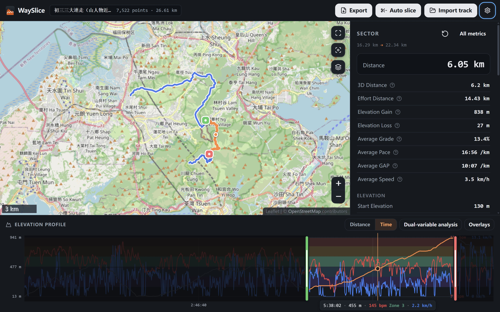

### モバイル

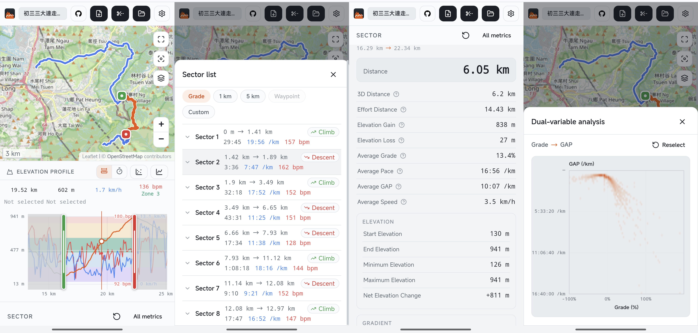

### 時間を X 軸に

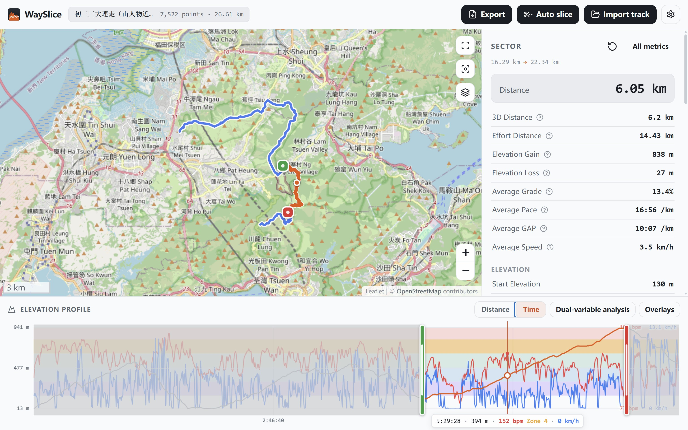

### 自動分割

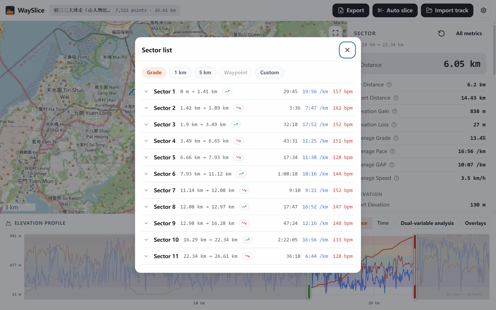

### すべての指標

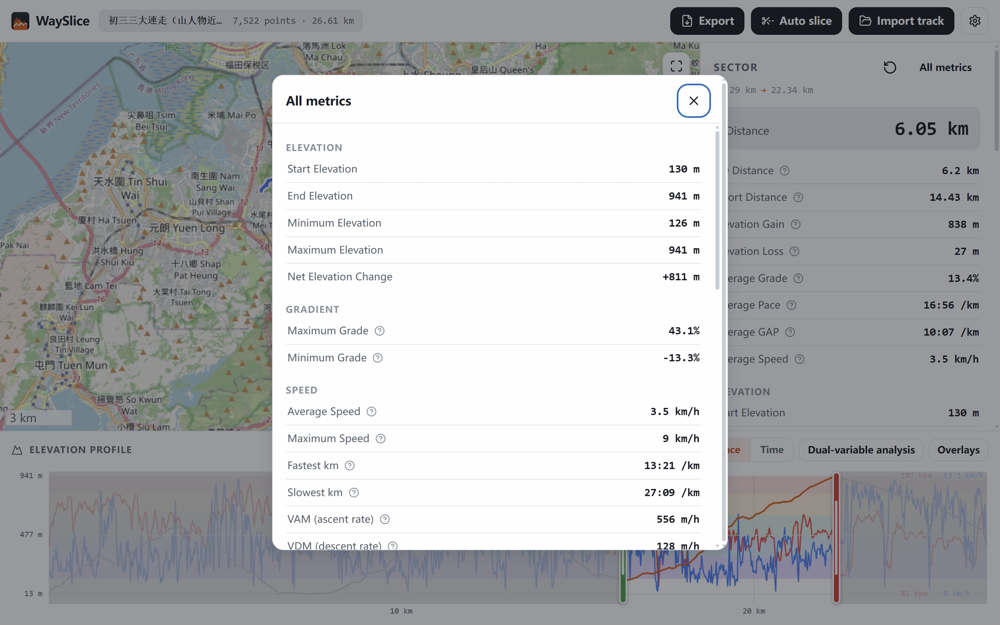

### 複数のベースマップ

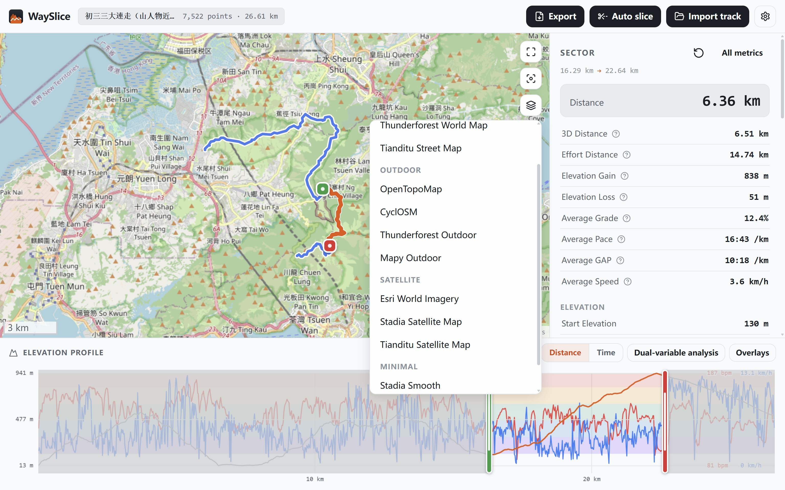

### ウェイポイント情報

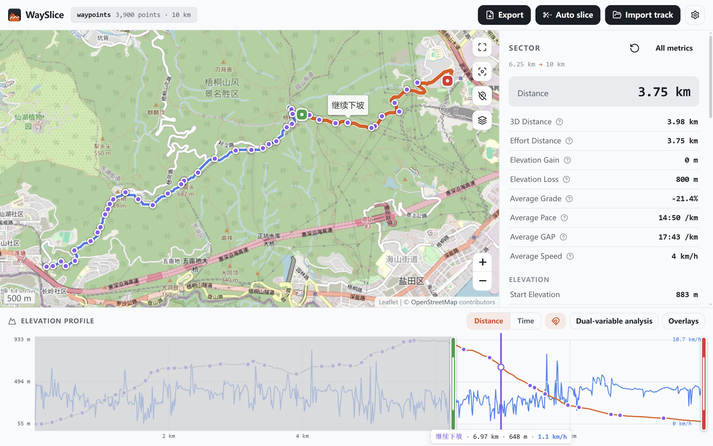

### ウェイポイントにスナップ

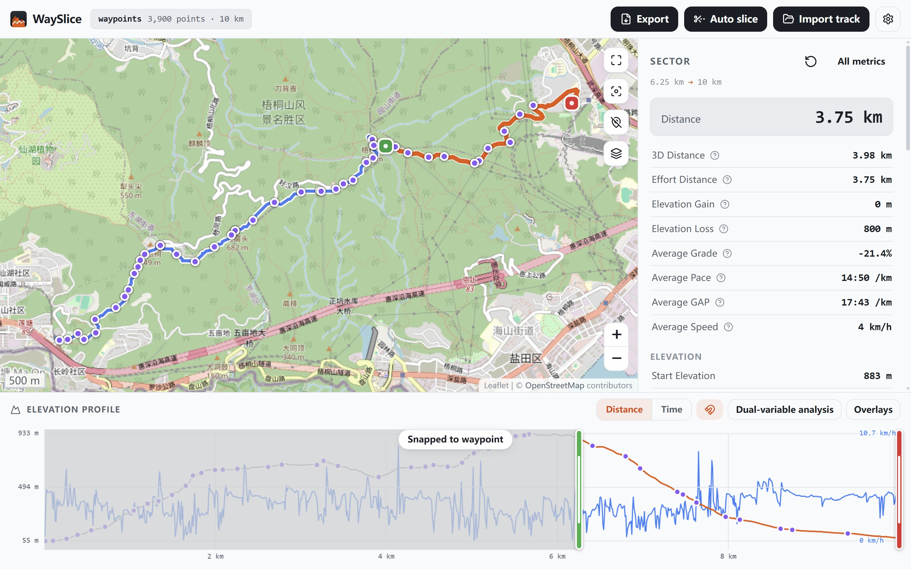

### 2変数分析

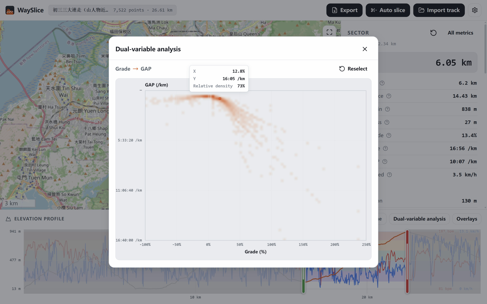

### ファイルのエクスポート

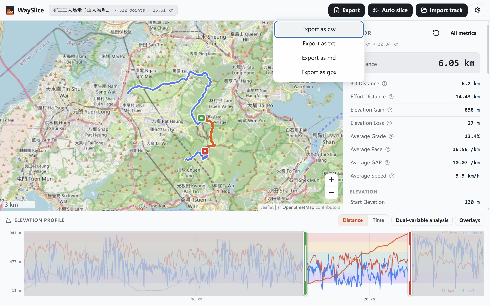

### 設定

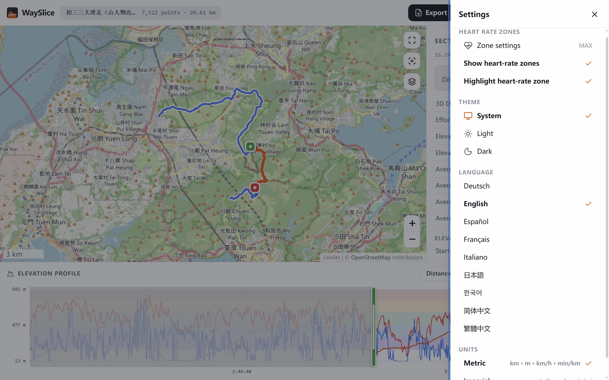
